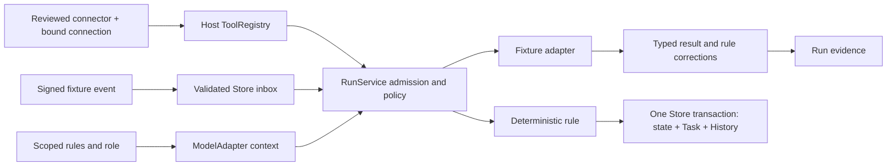

# Connections: credential-free reference slice

Status: implementation decision for an isolated proof, 2026-09-09.
Base: origin/main `11829e1962b448360d3fc7aaba7c38fda6833a84`.
Roadmap read completely: **2026-09-09.5**, from the active Runtime worktree.
The branch's tracked roadmap is .4; this feature does not overwrite that mirror.

## Current state and ownership

`RunService.start/step` already own durable admission, step identity, budgets,
leases, cancellation, conservative recovery and events. `ToolRegistry` owns tool
schemas and effect metadata. `NativeAgent` owns the bounded model/tool loop.
`RunService.use` is a pre-step deny/observe hook, after mandatory policy; it cannot
rewrite context or grant authority. `ModelAdapter.complete` is a whole-response
boundary, with no token-stream interception contract.

`Store.locked`, `Store.persist`, `Store.createTask` and `Store.addEntry` own project
state, tasks and History. The existing MCP SDK and `server/team/mcp.ts` implement
protocol plumbing, not a generic connection authority. There is no implemented
general rule catalogue, connector registry or durable webhook inbox in this base.

Codex owns the dirty Runtime continuation including harness, app, store, shared
harness types and several client files. Opus owns `server/trust/*`, identities,
accounts and credential boundaries. Their local work was inspected, not copied
or modified. The newer Trust resolver is not in this branch's published base.

## Decision

Add an opt-in fixture composition over the existing host. A reusable manifest and
reviewed host adapter describe capabilities; a project-owned connection pins a
manifest digest, version, approved resources and scopes. Manifest annotations are
requests, never permission grants. Only explicitly registered fixture handlers
can execute. No executable package loading, real transport or credential store.

Use an additive optional project-state extension through Store's existing lock
and persistence. Clone state before editing; persist the event receipt, materialized
observation, rule match, issue mapping, Task and History together. A failed persist
must leave the live state unchanged. The bounded inbox refuses new events when
full instead of pruning deduplication receipts. RunService owns processing runs
and retries; no scheduler/workflow engine is added.

Admission saves the immutable connection binding before creating the Runtime run.
Either interruption point can be retried against the same binding; a different
identity/generation or scope cannot reinterpret it. A committed issue receipt
also survives interruption before the Runtime result checkpoint. Startup recovery
uses that receipt to finish the existing run without repeating its Task effect.

Use one generic, versioned rule representation for standing guidance, triggered
corrections/work, and deny-only policy. Scopes are conjunctive selectors. All
matching prohibitions accumulate; narrower guidance never erases a prohibition.
Context is selected for a run's approved capability/resources. A ModelAdapter
decorator supplies the context at the real pre-model boundary and records the
exact selected rules; normalized results carry targeted corrections. This is
instructional/corrective, not model compliance enforcement. Authority checks run
again in trusted tool handlers immediately before dispatch and result acceptance.

The trusted host supplies a _current_ HarnessPrincipal at each boundary. The
default is denial; the demonstration supplies only synthetic local principals.
This consumes the existing runtime contract and makes no authenticated-human or
production tenant claim. Bind this consumer to Opus's shared resolver after the
Runtime/Trust continuation lands; do not create a replacement resolver here.

## Alternatives and consequences

- Generating and launching arbitrary MCP code would add an uncontained execution
  and credential boundary before the capability contract is proven: rejected.
- Adding a connector database, task system or new workflow engine duplicates
  existing authority: rejected.
- Extending all owned Runtime/Trust files now would collide with concurrent work:
  defer production composition. The proof uses public host interfaces and new files.

The UI is a narrow opt-in fixture surface using existing Field typography,
components and colors. It is not mounted into ordinary desktop navigation yet.
No real Toast connection, internet listener, model billing, packaged release or
cloud dependency is implied. Process/worktree separation is not a security sandbox.

## Rule scopes and interception guarantees

Rules share one generic schema in shared/connection-rules.ts and one evaluator
in server/rules.ts. Scope selectors cover global, tenant/business, project/workspace,
user, connector, connection, resource/location, capability, workflow, task, run
and role. An empty scope is global. Every specified selector must match. Active
standing rules accumulate in broad-to-narrow order; they do not grant capabilities.
This first slice does not resolve conflicting instructional prose or override
broader workflow thresholds. Such proposals must be reviewed as explicit revisions.
All applicable deny policies remain in force regardless of narrower guidance.

| Actual boundary                                                | Guarantee                                                      | Limitation                                                                        |
| -------------------------------------------------------------- | -------------------------------------------------------------- | --------------------------------------------------------------------------------- |
| Capability selection and injected role                         | Instructional context; enforced bounded tool exposure          | One fixture investigator role; no general intent-discovery planner                |
| RuleModelAdapter.complete before model request                 | Instructional, with recorded selection                         | Model obedience is not enforced by prose                                          |
| Model streaming                                                | Unsupported                                                    | ModelAdapter returns whole responses; no token interception seam                  |
| NativeAgent tool proposal                                      | Observed, typed validation                                     | A proposal itself grants no authority                                             |
| RunService mandatory policy, then Connections hook and handler | Enforced for this host path                                    | Fresh principal, pin, resources, operations and effect checks; no OS containment  |
| Connector result acceptance                                    | Corrective plus schema/scope enforcement                       | Unknown quantities remain null; no reasoning or inventory is invented             |
| Event ingress                                                  | Enforced                                                       | Signature, bounded timestamp/payload, approved location, immutable event identity |
| Workflow transition                                            | Enforced deterministic condition and atomic local receipt      | Creates/updates an existing Store Task; no general workflow graph engine          |
| Postcondition                                                  | Verification-only                                              | Confirms stored result/Task/receipt, not a physical stock count                   |
| Completion/evidence                                            | Observed                                                       | Runtime result plus rule id/version/scope/predicate/source and input evidence     |
| Error/retry                                                    | Observed failure; enforced attempt/timeout limits on this path | Reads only; transport cancellation cannot sandbox a dishonest in-process handler  |
| Replay/evaluation                                              | Verification-only                                              | Evaluates reviewed candidate rules without activation or effects                  |

Direct-agent model/tool/pre-effect interception is reported unsupported. Shared
ingress and normalization guarantees apply only when those calls actually pass
through the Connections service. No wrapper claims control of an external agent's
independent tools, filesystem, network or token stream.

Connector packs can supply reviewed standing/correction rules only. User workflow
and policy proposals remain inactive until an exact proposal digest is approved
by current connections.manage authority. Connection controls cannot disable a
global/business/project or connector-wide rule. Replaying an old activation
cannot re-enable a subsequently disabled rule. Changed pack guidance is refused
pending explicit migration; it never silently replaces or enables saved rules.

The two natural-language grammars compile a numeric low-stock workflow and an
external-write prohibition. The latter deliberately previews denial of all external
writes, including ordering. Ambiguous hours, categories and conditional preferences
produce questions and no executable rule. Pure replay supports version comparison;
automatic learning, adoption and a rollback UI are deferred. A reviewed new version
can restore earlier content without reusing an old approval as fresh authorization.

Bindings carry only immutable scope/identity references, not credentials. A
registered scripted adapter prevents accidental same-ID model substitution, but
both adapter registration and test observers are trusted host code. Registration
is not executable-code isolation. The fixture signer is never passed to the agent.

## Subsequent containment and approval seams

Future transports must enforce destination allowlists and redirects at the actual
network boundary, lease authentication through Trust, reconcile read ambiguity,
and bind write approval to exact target/base/actor/destination/effect/expiry.
Egress grants and exact write approvals remain separate. Generated candidates are
inactive and inspectable; changes to scopes, resources, destinations, providers,
spending or writes require a separate authority review. Versioned rule replay is
evaluation only; it cannot activate a proposal or expand authority.

Local event processing works only while the host runs. A future customer-hosted
worker or managed relay may implement the same bounded inbox contract. Production
Toast needs a publicly reachable HTTPS receiver with prompt durable acknowledgement;
the local fixture receiver is not such an endpoint.
