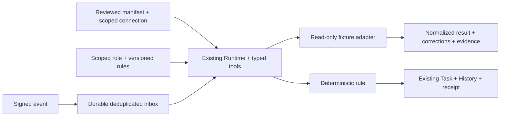

# Connections proof handoff

2026-09-09. This is an isolated, credential-free source proof for Diomedes.
It completes authorize -> invoke -> normalize -> signed ingress -> deterministic
triage -> durable Task/History -> restart/replay -> revoke, with scoped rules in
the existing Runtime path. It is not a released app or an authenticated Toast
integration. No commit, push, publication or shared release build was performed.

## Current state found

Base is published origin/main 11829e1962b448360d3fc7aaba7c38fda6833a84.
The local main checkout was older and contained unrelated docs/superpowers work.
The active Runtime worktree contained a substantial uncommitted continuation.
Its live roadmap 2026-09-09.5 was read completely; this branch's tracked .4 mirror
was not overwritten. Opus's Trust work and the Runtime ownership note were read.

RunService already owns admission, leases, effects, cancellation, budgets,
checkpoints and conservative recovery. NativeAgent owns the model/tool loop;
ToolRegistry owns typed operations. Store owns project state, Tasks and History.
The base has a pre-step hook and a whole-response ModelAdapter, but no general
connection catalogue, webhook inbox or scoped rule catalogue. Existing MCP team
support does not provide business connection authority.

## Architecture

The proof is a new consumer of those public interfaces, with additive optional
project-state fields. All Store edits use a clone plus its existing lock/persist
path. The Runtime binding is persisted before run creation. Inbox identity and
Task effects are transactional within one Store state; retry reads the receipt.

No second runtime, credential store, Trust resolver, task service, scheduler or
document writer is introduced. See [architecture and hook guarantees](ARCHITECTURE.md)
and [official research](RESEARCH.md).

## Files / components

All files below are additions. No pre-existing tracked file changes.

| Files                                                                               | Responsibility                                                                                                                                    |
| ----------------------------------------------------------------------------------- | ------------------------------------------------------------------------------------------------------------------------------------------------- |
| shared/connections.ts                                                               | Manifest, scoped instance, normalized observation, inbox, run binding and additive Store extension                                                |
| shared/connection-rules.ts; server/rules.ts                                         | One generic versioned rule vocabulary, scope selection, deterministic predicates, deny policy, proposal/replay and ModelAdapter context decorator |
| server/connections/service.ts                                                       | Runtime admission/invocation, fresh authority checks, durable ingress, triage receipts, recovery, rule adoption and health                        |
| server/connections/credentials.ts                                                   | Ephemeral synthetic HMAC secret behind verification and leak checks; no durable secret store                                                      |
| server/connections/toast.ts                                                         | Documented stock semantics, strict event normalization, manifest and three-location fixture                                                       |
| server/connections/fixture.ts; fixture-model.ts                                     | Opt-in host composition, second catalogue connector and registered scripted model                                                                 |
| server/connections/openapi-candidate.ts; fixtures/connections/petstore.openapi.json | Offline curated GET candidate generation and reduced official-example fixture                                                                     |
| client/connections/fixture-main.tsx; connections.css                                | Business-facing fixture status, permissions, quantities, rule proposal and issue evidence                                                         |
| scripts/connections-demo.ts                                                         | Disposable loopback fixture server; never mounted by ordinary app startup                                                                         |
| scripts/connections-process-proof.ts; connections-ui-proof.ts                       | Separate-process and browser/HTTP acceptance drivers                                                                                              |
| tests/connections.test.ts; openapi-candidate.test.ts                                | Connector, rule, authority, replay, recovery and candidate refusal regressions                                                                    |
| docs/connections/_; evidence/connections/_                                          | Design, sources, handoff, frozen file hashes and reproducible evidence                                                                            |

The exact import list and SHA-256 hashes are in IMPORT-MANIFEST.json. It excludes
itself, ignored scratch profiles/logs and the node_modules junction. The planning
ownership note is outside the repository at
F:/Achilles/planning/DIOMEDES-CONNECTIONS-OWNERSHIP-2026-09-09.md.

## Implemented

- Pinned reviewed manifests, typed input/result contracts and per-connection
  resources, operations, vendor scopes and revocation generation. The catalogue
  fixture uses the same service with a completely different result schema.
- Real RunService/NativeAgent dispatch with one scoped investigator role and only
  approved tools/resources. Standing business/workspace/connector guidance is
  selected per call. Result corrections carry rule versions and provenance.
- Strict HMAC-validated event ingress, durable acknowledgement, duplicate conflict
  refusal, bounded inbox, out-of-order protection and stale/conflict reconciliation.
- One manager Task per source condition with threshold, quantity, location,
  timestamps and rule provenance. Duplicate receipt replay does not duplicate
  Tasks or History. Interruption before/after Runtime admission and after Store
  effect commit is covered.
- Inspectable inactive natural-language proposals for numeric thresholds and an
  external-write prohibition. Exact-digest adoption, version history, bounded
  disable controls and pure rule replay. Old approvals cannot re-enable rules.
- Healthy/stale/paused/disconnected/reauthorization/source-error health. Group
  freshness uses the oldest approved location refresh. Reconnect invalidates old
  runs and requires a new source refresh.
- Inactive OpenAPI GET candidate with schemas, provenance and no approved origins.
  The generator never fetches a URL or executes arbitrary generated code.

## Toast proof

All three restaurants, menu items, credentials, source responses, events and model
responses are synthetic. The code shape and semantics were checked against current
official Toast documentation. There was no authenticated API request, real webhook
subscription, restaurant/account eligibility check or external Toast write.

The proof preserves IN_STOCK as available with an untracked quantity, OUT_OF_STOCK
as unavailable without inventing a number, valid QUANTITY as reported, and unknown
statuses as unknown. The selected-item POST operation is explicitly a read. The
source returns menu/modifier availability, never physical ingredient inventory.
See [Toast research](RESEARCH.md) for authentication, scope, subscriptions,
signatures, retries, rate limits and sandbox/access prerequisites.

## Tests and verification

Run commands from F:/Achilles/diomedes-wt/connections-proof. Existing dependencies
are reused through a node_modules junction; no package or lockfile was changed.

To open the interactive fixture, run `npx --no-install tsx scripts/connections-demo.ts`
and visit `http://127.0.0.1:47639`. It uses only the disposable
test-results/connections-demo profile. Ctrl+C closes that owned fixture server.

| Command                                                                                                                                                      | Result / evidence                                                                                                                                                                                      |
| ------------------------------------------------------------------------------------------------------------------------------------------------------------ | ------------------------------------------------------------------------------------------------------------------------------------------------------------------------------------------------------ |
| npm run check                                                                                                                                                | TypeScript passed after final code changes; see verification.json                                                                                                                                      |
| npx --no-install vitest run --no-file-parallelism --reporter=json --outputFile=evidence/connections/unit-tests.json                                          | 537/537 passed across 20 test files                                                                                                                                                                    |
| npx --no-install vitest run tests/connections.test.ts tests/openapi-candidate.test.ts --reporter=json --outputFile=evidence/connections/connector-tests.json | 54/54 passed: 40 Connections tests and 14 OpenAPI candidate tests                                                                                                                                      |
| npx --no-install tsx scripts/connections-process-proof.ts                                                                                                    | Three distinct processes; abrupt exit after durable ingress; one T1 after recovery and duplicate replay; revoked reads/events refused; synthetic secret absent from six durable files and child output |
| npx --no-install tsx scripts/connections-ui-proof.ts                                                                                                         | 9 checks passed; zero page errors; signed HTTP 202 returned before held triage in 20 ms on this machine                                                                                                |
| npx --no-install vite build --outDir test-results/connections-client-build                                                                                   | Existing app client compilation passed; no postbuild packager was run                                                                                                                                  |

The browser proof used local Edge with the source fixture, at 1440px and 720px.
Both rendered screenshots were personally inspected. The narrow view has no
horizontal overflow. This is not Electron/package/installer or accessibility-audit
proof. Local acknowledgement timing is not a real Toast delivery SLA.

The new fixture entry was also compiled directly with Vite's build API to
test-results/connections-fixture-build; verification.json preserves the exact
command. Neither client compilation ran the package postbuild hook.

Two parallel full-suite attempts exposed timing-sensitive failures in untouched
tests/work-admission.test.ts: first a restart snapshot had no Need; then an abrupt
exit driver returned 1 instead of its expected 72. The isolated 33-test file passed.
The first full run also caught a missing version in a newly added test's proposed
step; that test input was corrected and now reaches the actual deny hook. No
existing tests were weakened or shared Runtime files changed. Raw initial reports
are retained under test-results/connections-review; final machine-readable evidence
records these attempts as well as the final result.

An independent Muse review through OpenCode Go found the admission gap, overly
broad rule-disable control, same-ID model substitution risk, read-time conflicts
and pack-upgrade ambiguity. Each received a narrow fix and regression coverage.
Its suggestion to base group freshness on the newest location was rejected: that
would conceal stale locations. The proof uses the oldest location intentionally.
An additional recovery test confirms that an ignored-event receipt can complete
its interrupted Runtime checkpoint without creating an issue.

## Security / Trust

Enforced on this service path: reviewed immutable manifest pins; typed schemas;
current principal/project/tenant/capability checks; generation revocation; selected
resources/operations; local destination; read-only adapters; deterministic deny
rules; signed ingress and bounded event identity; exact proposal activation;
receipt deduplication; result acceptance after authority/cancellation checks.

Instructional: standing guidance, role text and model compliance with source
terminology. Corrective: schema-validated normalized observations and targeted
unknown-quantity guidance. Observed: proposals, completion and selected-rule
evidence. Verification-only: postconditions and rule replay. Unsupported: direct
agent tool/stream interception, OS isolation, arbitrary-code containment and
production human/device authentication. The complete boundary table is in
ARCHITECTURE.md.

The current-principal resolver defaults to denial. The opt-in fixture supplies
synthetic principals; neither its loopback address nor its HTTP header is an
authenticated human identity. The script-only adapter registry is a host wiring
guard, not a sandbox. Trusted adapter code remains in-process. Leak checks exercise
the synthetic secret and known credential keys; they are not general DLP.

## Collisions / dependencies

Codex Runtime and Opus Trust remain authoritative. Their dirty files were left
intact. Windows app/build ownership is recorded in the planning note. Bind this
consumer to the final currentAuthority/refOf exports after those changes land;
do not ship the fixture principal as production authentication. Register once per
HarnessHost and call Connections recovery after host initialization on exclusive
startup. The base bridge warns that connection capabilities are unavailable;
the dedicated consumer still recovers them, as the process evidence confirms.

Normal navigation, app endpoints and desktop packaging are build-owned seams.
The fixture entry is deliberately separate. An importer must rerun all checks
against the completed Runtime/Trust snapshot. The proof does not certify that
later integration or a concurrently produced Windows artifact.

## Deferred

Real Toast authentication/transport and broker leases; account/plan checks;
subscription management; public HTTPS ingress; provider backoff/pagination; full
menu synchronization; background polling and always-on hosting; full issue
resolution/reopen policy; arbitrary connector installation/discovery; signed
package distribution; OS network isolation; generic workflow graphs; model-token
stream intervention; full rule authoring/rollback UI; automatic learning/adoption;
real model-provider egress; consequential external writes and approval execution.

Inbox/rule/evidence capacities fail closed rather than evicting receipts. Retention,
archival and long-running growth require review before a pilot. Read operation
recovery is exposed through Runtime, but this consumer automatically resumes only
its event-processing runs. The runtime's whole-run wall budget remains a base
contract limitation; this service enforces its own source-call timeout.

## Next smallest safe slice

Import the frozen consumer into the completed Runtime/Trust app composition and
repeat the credential-free acceptance flow through the ordinary Connections
navigation with current authority resolution. Keep real provider access a later,
separately verified read-only pilot. This is smaller and more reviewable than
adding a transport and new app/Trust wiring at the same time.

## Roadmap impact

This advances existing directions, not a new roadmap: M5 scoped Diomedes-led
rules/tools (fixture preparation only, not its genuine-model acceptance gate),
M7 deterministic durable transitions, M8 inbox/event governance, M9 rule replay
and evidence, and M11 bounded connector interop. It does not complete those
milestones, change local-first economics, or justify a cloud platform. No roadmap
amendment or overwrite is needed. The build task can reconcile its newer mirror.

## Proposed commit

feat(connections): add scoped fixture connectors and durable rule triage

Changed-file list: every file in IMPORT-MANIFEST.json plus that manifest itself.
All are additions. Scratch logs/profiles, dependency junctions and machine config
are excluded. This is a proposal only; nothing is staged, committed or pushed.
