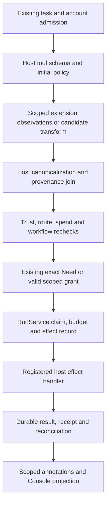

# EXT-01: Nectovia extensions through the existing Runtime

Status: **Proposed architecture; no executable extension support is implemented by this record.**
Date: 2026-10-03 (America/New_York).
Decision owner: Andrew. Existing Runtime, Trust and pack invariants remain binding.
Source baseline: remote main 4b17aec4df927425778a9232c19f3e463404f3c3.
Canonical mirrors read: Core Pillars, Live Roadmap and Project Memory, all 2026-09-27.2.

## Decision

Adapt Claude Code's small, inspectable plugin contributions, typed events,
commands, presentation slots and advisory observations. Extend Nectovia's
existing capability-pack lifecycle and Runtime seams. Do not adopt a general
middleware chain that can replace authorization, dispatch, accounting or audit.

A skill remains guidance. A pack remains a versioned composition of capabilities.
An executable hook is an additional pack contribution with separately declared,
host-enforced access. Installing, activating, signing or reviewing any of these
grants no action authority. Runtime admits work; Trust authorizes effects; Store
records changes; existing account, route and spend services admit inference.

Ship deterministic instruction auditing and passive contributions first. Keep
third-party executable contributions unavailable on a platform until their
containment and broker boundaries pass adversarial qualification there. Trusted
first-party hooks may remain compiled application code, with that trust stated
explicitly. They are not evidence of third-party isolation.

## Research scope and evidence

The owner-referenced Gmail message 1a0ffbeb5f0e0d2c supplied the announcement.
The findings below were checked against public primary documentation and source
on 2026-10-03. No Claude mod was installed or executed, no customer provider was
called, and no claim of live compatibility follows from this inspection.

### Claude's public design

1. A mod is a plugin with a JavaScript/TypeScript hooks module exporting
   register(on), located through the modules entry in hooks/hooks.json.
   Handlers can observe, pass a changed event onward, or answer instead of the
   built-in behavior. Code/UI can be shared between CLI and Desktop's Code tab;
   headless/SDK sessions can run hooks without drawing their UI. The public
   baseline is Claude Code 2.1.287; the current changelog also lists 2.1.288.
   [Overview](https://code.claude.com/docs/en/plugins/mods/overview),
   [authoring](https://code.claude.com/docs/en/plugins/mods/create).
2. Events include tool.call/tool.check, prompts/context, commands, turn/session
   lifecycle, subagent spawning and rendering. Hooks compose in source tiers and
   dependency order. Answering without next can prevent later behavior from
   running. A failed hook normally falls through if it failed before next;
   a completed downstream result stands if it failed afterwards. Blocking hooks
   need explicit failure handling. This is not Nectovia's authorization model.
   [Events and failures](https://code.claude.com/docs/en/plugins/mods/events).
3. The module has no direct Node APIs, but its $ API exposes files, processes,
   HTTP, model calls, tools, timers, session messages and state. That API runs
   with the user's machine access; mods are not sandboxed, and their processes
   run outside Claude's Bash sandbox. A restricted module language therefore
   does not establish a restricted effect boundary.
   [API](https://code.claude.com/docs/en/plugins/mods/api),
   [trust disclosure](https://code.claude.com/docs/en/plugins/mods/overview#decide-whether-to-trust-a-mod).
4. Managed hooks and the built-in sec-default guard protect some managed
   instructions, settings and tool decisions. The guard's deployment depends on
   managed settings/account context and its configured position. Ordinary ask
   decisions and non-managed hook decisions can be overridden; even protected
   tool denials do not govern a mod's separate file/process API calls.
   Permission-prompt drawing is protected, but a mod can decide before it appears.
   Nectovia must enforce its authority independently of plugin order and plan.
   [Administration](https://code.claude.com/docs/en/plugins/mods/admin).
5. Mods have typed UI elements and bounded host APIs. The documented hook CPU
   time limit excludes time awaiting most API calls, so it is not an overall
   wall-clock deadline. Validation lists hook/API footprints; the test kit can
   exercise events and drawings with stubs. These are useful authoring patterns,
   not proof that declared capabilities or resource limits contain malicious code.
   [Interface](https://code.claude.com/docs/en/plugins/mods/interface),
   [reference](https://code.claude.com/docs/en/plugins/mods/reference),
   [test kit](https://code.claude.com/docs/en/plugins/mods/test).
6. You should know is an opt-in built-in that surfaces notes from a side agent.
   The 2.1.287 changelog qualifies availability to first-party sessions with
   telemetry enabled. The inspected public mods tree contains diff, agents-md,
   sec-default and telemetry; it does not expose this advisor's implementation.
   Its prompt, model, thresholds, scheduling, budget and failure behavior remain
   unverified here. Do not invent them from the announcement.
   [Changelog](https://code.claude.com/docs/en/changelog#2-1-287),
   [built-ins](https://code.claude.com/docs/en/plugins/mods/overview#mods-built-into-claude-code).
7. Skills/plugins can sync from a claude.ai account with opt-outs. Current skill
   docs describe downloads on invocation and changes in a running session, and
   enumerate sessions that do not sync. AGENTS.md can supply project instructions
   under a configurable file policy. Prompt-audit checks instructions, rules,
   skills, commands and agents; it produces findings and proposed edits rather
   than applying the patch automatically.
   [Synced skills](https://code.claude.com/docs/en/skills#where-synced-skills-load),
   [instruction files and auditing](https://code.claude.com/docs/en/memory),
   [prompt-audit introduction](https://code.claude.com/docs/en/changelog#2-1-283).
8. Claude's directory portal accepts connector or GitHub-hosted plugin
   submissions, performs validation/safety scanning, exposes review feedback,
   and lets an approved publisher choose publication time. The announcement
   does not establish artifact signing, reproducible builds, third-party
   sandboxing or equivalent mod support on every Claude surface.
   [Directory submission](https://claude.com/blog/build-plugins-for-claude).

### Public implementation material inspected

The 2.1.288 changelog already reports fixes for stale buttons invoking another
action, tool hooks using the wrong subagent worktree, reloads ending background
sessions and mod rows crashing a task dialog. Use these as regression fixtures
for identity, scope, cancellation and bounded rendering; they do not establish
that Nectovia's adapter exhibits those failures.
[Observed upstream fixes](https://code.claude.com/docs/en/changelog#2-1-288).

Use these pinned trees when reproducing this review; moving main URLs are
discovery links, not evidence identities.

| Source                                                                                                                                           | Inspected material                                                                           | Useful lesson and limit                                                                                                                                              |
| ------------------------------------------------------------------------------------------------------------------------------------------------ | -------------------------------------------------------------------------------------------- | -------------------------------------------------------------------------------------------------------------------------------------------------------------------- |
| [Claude Code tree](https://github.com/anthropics/claude-code/tree/1c229fcd1e1e4e452e29a8f116b45fe4cfe2c528/mods)                                 | sec-default README/register.ts, agents-md register.ts, built-in manifests and entry paths    | Host-pinned caller/provider tiers protect managed provenance. They still leave broad mod APIs available.                                                             |
| [sec-default source](https://github.com/anthropics/claude-code/blob/1c229fcd1e1e4e452e29a8f116b45fe4cfe2c528/mods/sec-default/hooks/register.ts) | Tier bypass, protected prompt/settings events, tool.check restoration and failure handlers   | Preserve policy outside user hooks; do not copy a configurable policy plugin as Nectovia's root authority.                                                           |
| [agents-md source](https://github.com/anthropics/claude-code/blob/1c229fcd1e1e4e452e29a8f116b45fe4cfe2c528/mods/agents-md/hooks/register.ts)     | Root discovery, configurable fallback, scoped nested instructions and read-result attachment | Reuse Nectovia's instruction delivery; importing another product's file precedence would change policy.                                                              |
| [Playground tree](https://github.com/anthropics/claude-code-playground/tree/569c5283d9a0a7ee7938df85bb32e4f48cbb8c86/claude-code/mods)           | token-weather, replay-theater and blast-radius README plus hooks/\*.mjs                      | Passive metrics, edit-attempt review and a hold UI are concrete examples. Attempt timelines do not prove applied files; command previews do not provide containment. |

The sample READMEs report earlier live demonstrations and distinguish later fixes
or fallback paths that were not retested live. Their results were not reproduced
here. In particular, Blast Radius's preview/hold pattern is inspiration for a
Trust-backed preview, not a security mechanism to transplant.

The playground has an Apache-2.0 license. Claude Code's LICENSE.md reserves rights
under Anthropic's commercial terms. Public built-in source is an inspection
reference, not permission to redistribute it. This record copies no upstream
implementation. [Playground license](https://github.com/anthropics/claude-code-playground/blob/569c5283d9a0a7ee7938df85bb32e4f48cbb8c86/LICENSE),
[Claude Code license](https://github.com/anthropics/claude-code/blob/1c229fcd1e1e4e452e29a8f116b45fe4cfe2c528/LICENSE.md).

## Primitive-by-primitive repository comparison

Presence means inspected source at the named baseline, not a new runtime test,
desktop release, live-provider qualification or complete roadmap milestone.
Historical harness H01-H15 names differ from the unified package's newer IDs.

| Claude primitive                               | Current Nectovia home and behavior                                                                                                                                                                                                                                 | Disposition / missing work                                                                                                                                                                                             |
| ---------------------------------------------- | ------------------------------------------------------------------------------------------------------------------------------------------------------------------------------------------------------------------------------------------------------------------ | ---------------------------------------------------------------------------------------------------------------------------------------------------------------------------------------------------------------------- |
| Typed lifecycle/function hooks                 | [RunService](../../server/harness/run-service.ts) has ordered trusted hooks, copied inputs, mandatory checks before/after, and a hold-only return shape. [Host](../../server/harness/host.ts) installs bridge and stream-rule hooks.                               | **Adapt.** Typed, phase-specific contributions with broker enforcement. Current hooks are not a third-party SDK or sandbox.                                                                                            |
| Observe ongoing work                           | [StreamRuleService](../../server/stream-rules/service.ts), [bounded matcher](../../server/stream-rules/evaluator.ts), [external-work watch](../../server/stream-rules/work-watch.ts) record firings and hand interventions to supervision.                         | **Copy the useful pattern.** Add scoped passive subscriptions at existing event seams; no second watcher that owns execution.                                                                                          |
| Hold a call / deny it                          | RunService holds at waiting_approval and records step.held; [present](../../server/harness/present.ts) and [bridge](../../server/harness/bridge.ts) project an ordinary Need. H16 refuses an unsupported tool hold.                                                | **Adapt.** Persist a hold with the exact intent and existing Need semantics; a plugin dialog is never an approval receipt.                                                                                             |
| Rewrite tool arguments                         | Current hook copies cannot rewrite the captured intent. [ToolRegistry](../../server/harness/tools.ts) owns schemas, effect class, targets and limits.                                                                                                              | **Adapt narrowly, later.** Return a candidate before admission; host canonicalizes and authorizes it from scratch. Never edit an in-flight or approved call.                                                           |
| Answer instead of a built-in                   | Registered handlers run under declared effects and RunService; [Store](../../server/store.ts) owns recorded file writes.                                                                                                                                           | **Reject arbitrary replacement.** A pure formatter/view can replace presentation. An alternate tool is a separately declared host adapter, not a fabricated success result.                                            |
| Approve in tool.check / skip policy middleware | [Policy](../../server/harness/policy.ts), [approval admission](../../server/approval-admission.ts), account/Agent gates and recorded effects own authority.                                                                                                        | **Reject.** No extension allow verdict, grant minting, policy interception, receipt writing or reviewer substitution. An extension may request stricter treatment only.                                                |
| Add commands and tools                         | [Pack manifest](../../shared/pack-manifest.ts) declares contributions; [on-demand loader](../../server/pack-contributions.ts), [palette](../../client/console/Palette.tsx) and ToolRegistry supply existing seams.                                                 | **Adapt.** Namespace commands; host dispatches typed requests. The manifest's tool declarations do not already implement arbitrary downloaded handlers.                                                                |
| Draw panes, bands, status or transcript rows   | Pack UI declarations target existing Console surfaces. Core Files/history and software-pack views remain authoritative.                                                                                                                                            | **Copy slots; adapt rendering.** Declarative views over allowed projections. Never replace Need controls, billing/account identity, evidence badges or the model's authoritative result.                               |
| Model calls, timers and session APIs           | [Recorded evaluation](../../server/harness/evaluation.ts), [managed evaluation port](../../server/harness/evaluation-managed.ts), [supervision](../../server/supervision/service.ts) and current run controls exist.                                               | **Adapt.** All work is admitted and attributed by these owners. No ambient keys, arbitrary model API, recursive agent runtime or free background timer.                                                                |
| You should know advisor                        | [Jev advisor](../../server/harness/jev-advisor.ts) and typed EvaluationPort are existing advisory seams; the managed provider row is currently Jev-specific. H16 matching itself is deterministic.                                                                 | **Adapt to a model-neutral role.** Continuous missed-issue advice is not currently established by these components. It needs event selection, receipts, bounds and evaluation.                                         |
| Skills and AGENTS.md                           | [Instruction delivery](../../server/harness/instruction-delivery.ts), [instruction contracts](../../shared/capability-packs.ts), [task skills](../../server/task-skills.ts) load scoped, bounded, digest-pinned guidance.                                          | **Copy interoperability; preserve precedence.** Work/Build/Fix can use playbook guidance through the existing compatible-mode path. Recommended Ask/Plan launch metadata is not an action grant or a Work prohibition. |
| Packaging/version/dependencies                 | [Manifest](../../shared/pack-manifest.ts) has schema/host ranges, publisher fields, canonical digest and file hashes. [Pack lifecycle](../../server/pack-lifecycle.ts) stages local/bundled content, records operations and atomically activates verified objects. | **Reuse.** Signing, executable declarations and distributed trust are additional work. A publisher string plus digest is not authenticated provenance.                                                                 |
| Marketplace and account sync                   | Current PackSource is bundled or directory; its lifecycle explicitly has no registry/GitHub acquisition. P02 covers verified acquisition and P09 a private capability/skill catalogue; neither establishes a public marketplace or sync.                           | **Adapt after trust foundations.** Review immutable artifacts and sync account-scoped bindings. Do not infer marketplace/sync from local installation support.                                                         |
| Prompt-audit                                   | Rules/instruction views and Files/change review provide source and patch seams; no equivalent whole-setup audit was found in the inspected path.                                                                                                                   | **Copy early.** Deterministic checks first, optional model advice, findings and a reviewable patch; never automatic deletion of instruction files.                                                                     |

The current pack schema rejects outward permission requests and limits tool
effects to read, draft or local-write. This proposal preserves that restriction.
It does not turn a plugin request for email, payments or connector writes into
support for those effects.

The generic governance helpers in lifecycle.ts are not a substitute for actual
host wiring. In the inspected host, bridge.beforeStep and streamRules.hook are
installed; installGovernance is not called there. Future prompts must verify the
actual route they extend, rather than assuming that helper's presence proves
every effect recheck is installed.

## Where extensions may observe, hold, rewrite and render

The host offers a small typed protocol, not Claude's general next middleware.
An extension returns data. It never receives the Runtime, Store, principal
mutator, approval writer, provider credentials or the handler continuation.

| Surface                      | Observe                                                                              | Hold / refuse                                           | Rewrite                                                                 | Render / dispatch rule                                                      |
| ---------------------------- | ------------------------------------------------------------------------------------ | ------------------------------------------------------- | ----------------------------------------------------------------------- | --------------------------------------------------------------------------- |
| Installation/configuration   | Redacted compatibility, capability and provenance facts                              | Host refuses unverified/unsupported packages            | Propose a configuration diff                                            | Existing pack/configuration review; installation grants nothing             |
| Instruction/context assembly | Applicable permitted sources and governing IDs                                       | Required instruction conflict may block admission       | Add a bounded, attributed guidance section                              | Preserve source labels, instruction hierarchy and inspectable exclusions    |
| Before model                 | Admitted, redacted request metadata; selected content only with disclosure authority | Ask the host to park/cancel through existing controls   | Guidance proposal only; protected policy and route fields are immutable | Model/provider/payer/effort changes require route/configuration admission   |
| Before tool/effect           | Authorized candidate and permitted target projection                                 | Return a typed hold/refusal                             | Narrow allowlisted argument fields before final intent admission        | Recompute targets, labels, hashes, grants, budget and workflow guards       |
| After result/failure         | Permitted observation/receipt projection                                             | Propose a correction or task decision                   | Never rewrite raw result, status, receipt or History                    | A separate derived annotation may link to the original                      |
| Task/phase/handoff           | Current task/phase facts allowed to this account                                     | Existing phase decision/Need; no new approval lifecycle | Propose a revision through the current task API                         | No copied child grants, auto-acceptance, phase skipping or self-wake loop   |
| Console command/UI           | Scoped durable projections and extension-owned state                                 | Disable an extension view/action on failure             | Presentation-only formatting in declared slots                          | Commands emit authenticated host requests; UI cannot execute effects itself |

Observe-only does not mean unrestricted read access. Each subscription declares
event names, field projection, content classes and scope. Authorization happens
before payload delivery. A refused operation can produce an allowed redacted
diagnostic event; its denied data must not leak through an observer channel.

### Admission order and immutable identity

1. Resolve the authenticated account, tenant/project/task, live membership,
   capability, current grant generations, source restrictions and run bounds.
   The host seals that envelope and applies mandatory policy before delivering
   anything to an extension. Plugin-authored identity, origin or labels are data.
2. Fix the enabled extension identities/order for the admitted unit. The pack
   dependency lock, executable digest, API version and configuration revision
   identify each contribution. Host policy remains outside this order. Cycles,
   duplicate registrations and unresolved transform conflicts refuse admission.
3. A transform returns an expected original digest and a schema-checked patch
   to allowlisted arguments. The host creates the candidate, resolves canonical
   paths/targets and base versions, joins provenance and source restrictions,
   and compares required authority against the original. Denials cannot be
   overwritten. A materially different safe alternative is a new linked intent.
4. Freeze the final intent and run all effect, egress, membership, route,
   entitlement, spend and task-continuation checks again. The plugin cannot
   change tenant/account, project/task/run/step identity, capability, effect
   class, destination/provider/payer, confidentiality/integrity, grant/Need IDs,
   budget, workflow revision or idempotency key.
5. A changed action digest invalidates its previous exact approval. A currently
   valid scoped grant may cover the new candidate if the ordinary Trust path
   decides so; no redundant approval is invented for already granted work.
   A claimed/persisted intent is never patched in place. Create a linked step or
   revision using the existing changed-intent/reconciliation rules.
6. Persist before dispatch. Record original and final hashes, every transform's
   identity/output hash, policy/configuration revisions, hold reason/refs,
   approval/grant identity and actual origin. Retain the raw result and its
   receipt separately from derived views. Evidence persistence failure blocks
   an effect whose receipt cannot be safely recorded.
7. Recheck revocation immediately before the effect and at each broker request.
   Completed irreversible work is not repeated. Replay uses recorded extension
   outcomes with matching inputs/digests/order, never a fresh advisor opinion.
   Missing or changed required code stops replay; historical evidence remains.

Examples: replacing an output path with a canonical alias inside the same
permitted folder can be a validated candidate. Changing the destination to a
different connector account, changing a shell command, selecting another model,
or converting a draft to a send cannot be a transparent rewrite. They require
their existing separately admitted operation, where that capability is supported.

### Holds and deterministic workflows

A hold is a persisted Runtime state bound to the exact final action. The host
raises the existing Need and records the decision through approval admission.
Only that decision or the existing applicable authority can resume it.
Extension UI choices can navigate to a Need; they cannot settle it.

Record a deadline, owner and cancellation behavior. An unanswered, expired,
interrupted or unsupported interactive hold never becomes permission to run.
Headless work parks or refuses using current Runtime semantics. A required gate's
crash cannot erase its hold. Disabling the extension does not release the held
effect or discard its evidence.

Apply observations only at declared safe points in the current workflow/loop.
Record transform outputs and branch decisions before dependent work. Never
reorder DAG nodes, pick a new branch during replay, clear a phase approval,
replenish a child budget or consume a completed effect twice. An advisory note
arriving between nodes is a proposal; the existing task/runtime owner decides
whether and where to apply it.

## Packaging, versioning and provenance

Extend diomedes-pack.json, PackLifecycle and PackContributions; do not add a
second installer or execution registry. Existing strict v1 manifests do not
accept executable fields. Introduce an explicit new manifest/API revision and
migration/compatibility fixtures before accepting those fields; preserve v1
data-only packs unchanged.

The executable declaration must contain:

- Namespaced extension/contribution IDs; package semver; required host and
  extension API ranges; entry point and payload hashes; dependency lock with
  exact resolved versions/digests; configuration schema and state schema revision.
- Declared events and permitted field projections; observe/hold/transform/render
  role per event; allowed transform fields; host-defined failure class; maximum
  CPU, wall time, memory, state, I/O, queue depth and emitted actions.
- Requested broker operations, tool IDs and data scopes, allowed output slots,
  local/external route constraints, content classes, background/model need,
  parent-job budget ceilings and human-readable reasons. Requests remain requests.
- Publisher/key identity, source commit/repository, license, build recipe,
  dependency inventory, signed artifact identity and review receipt reference.

Build from pinned input bytes without install scripts, dynamic imports from
remote URLs, unlisted executable files or runtime dependency downloads. Include
all code/resources in the digest. Validate paths, case aliases, archive sizes,
link/reparse escapes and the full dependency closure. Static hook/API enumeration
helps a reviewer; the broker must enforce the same allowlist at runtime, including
indirect calls. Obfuscation or computed registration that defeats inspection is
ineligible for marketplace execution.

Use a detached Ed25519 signature via standard cryptography over a
domain-separated, canonical artifact identity: publisher namespace, pack ID,
version, manifest digest, payload root digest and dependency-lock digest.
Keep the signature outside the bytes it signs. Publisher keys must be verified
and allowed by current organization policy; a self-declared publisher name or
key is not verification. Record signer, verification time/policy and build
provenance without credentials. A valid signature authenticates bytes and a
publisher claim, not safety or effect authority.

Maintain independent package, manifest, extension API and state-schema versions.
Resolve host compatibility deterministically, then pin the artifact and config
for each admitted run. Executable updates show capability/data/cost differences
and do not activate on download. Development hot reload creates a new candidate
revision in a disclosed test profile; it cannot replace a module executing a
live admitted step. Unsigned developer packages remain in that isolated profile.

Key rotation requires verified continuity or an organization-authorized trust
change. Revoked keys/artifacts are denied at load and next effect, including for
already pinned runs; pinning is reproducibility, not permission to ignore a
revocation. A rollback loads previously verified compatible bytes and records
the operation; it never restores grants, spent credit, expired decisions or a
revoked artifact. Preserve prior configuration and History on failed updates.

## Sandboxing, brokerage and failure isolation

An out-of-process runner is containment for an extension contribution, not a
second Nectovia runtime. It owns no job scheduler, effect state, model router,
grant store or file writer. Runtime sends bounded events and accepts typed
responses over a versioned authenticated channel.

Use an OS-enforced boundary, qualified on each supported platform, with no
ambient credentials/environment, inherited user folders, arbitrary host handles,
process spawning, direct network, native modules or project filesystem access.
Pack code is read-only. Persistent extension state is bounded and keyed by
account/tenant/project/extension and schema/configuration revision; immutable
public code can share a digest cache, customer state cannot.

Node workers, node:vm, a TypeScript type, a Git worktree and a JSON API wrapper
are not security sandboxes. Electron renderer isolation likewise does not make
an unrestricted backend safe. Prefer declarative contributions while choosing
and proving a containment backend. If containment cannot be established, report
executable contributions unsupported on that platform; do not fall back to
unsandboxed execution.

Every broker call resolves current account/scope and goes through existing
registered tools or services: approved reads, proposal creation and
Store.writeRecorded for writes; current connector credential broker for any
supported connector use; existing route/egress/spend admission for inference.
Never expose raw secrets or a general fs/process/http/model API. Validate each
callback against the captured envelope and current authority, even if the
extension was reviewed or its model says the operation is safe.

Enforce wall-clock deadlines including broker waits, not only module CPU.
Terminate the isolated worker to stop loops that ignore cancellation. Apply
per-contribution and aggregate limits, deterministic ordering, queue
backpressure, deduplication and an attribution-preserving circuit breaker. Any
extension-requested I/O is separately admitted and budgeted, so a hook cannot
hide work inside an apparently pure transform.

| Failure class chosen by the host    | Result                                                                                                                                                                           |
| ----------------------------------- | -------------------------------------------------------------------------------------------------------------------------------------------------------------------------------- |
| Optional passive observer/formatter | Record failure/unavailability, stop its subscription/view, continue already authorized work; never mark the observer's check passed                                              |
| Advisor                             | Record cancelled/failed/skipped/unavailable, settle or reconcile usage, publish no unsupported finding; main work continues unless an existing explicit required check blocks it |
| Required guard or accepted hold     | Park/refuse the affected operation; timeout, invalid response, missing code and worker exit are closed failures                                                                  |
| Candidate transform                 | Refuse an invalid candidate. An optional suggestion may be discarded only before selection/admission; after adoption, failure cannot silently execute the original               |
| Effect may have reached its sink    | Existing reconcile_required behavior; never rerun a tool just because its observer/UI/extension crashed                                                                          |

Extensions cannot choose fail-open for a required guard. A global stop/disable
control immediately cancels subscriptions and denies new broker requests;
already-dispatched unknown effects retain reconciliation obligations. Rollout
can disable a broken contribution without disabling other projects or erasing
receipts.

### Native-engine boundary

[claudeArguments/environment](../../server/engines/claude.ts) already request
safe mode, empty setting sources, disabled hooks/plugins and slash commands,
restricted built-in/MCP tool lists, and nonessential traffic disabled.
Preserve that isolation. Do not enable Claude-native mods to implement a
Nectovia extension, or treat a vendor plugin's declared effect as a Runtime effect.

Claude documents that safe mode and disableAllHooks leave built-in mods active.
Therefore these launch controls alone do not prove absence of built-in model
calls or side effects. Qualify the current installed engine's extension
inventory, route/account, delegated tools, built-in behavior and containment
before widening an adapter. Use benign canaries in an owned profile and report
which behavior is enforced, observed or unsupported.

Nectovia cannot promise mediation of arbitrary activity inside another engine
or a user's OS session. An adapter that cannot establish a required permission,
data or payer boundary must refuse that operation. Refresh capability evidence
after installed-engine drift, rather than admitting by a vendor-version
allowlist or silently moving the job to another engine/model/account.

## Commands and Console rendering

Use names such as publisher.pack:command and declared Console slots. Render a
validated element/data tree with strict size, rate and accessibility bounds;
no arbitrary React execution, DOM script, inline HTML, Node integration,
remote code or credential-bearing links. Core chrome always identifies the
publisher, contribution and source records.

The host keeps Need decisions, authority/payer/model indicators, evidence status,
Stop and account switching outside extension rendering. An extension may show a
Trust preview but cannot impersonate one. Derived content must not erase,
relabel or overwrite raw model/tool text.

An action carries a host-issued capability token bound to the view revision,
account/project, contribution digest, command, payload digest, nonce and expiry.
Validate live membership, scope and expected revision on click; reject stale
buttons after reload, update, restart or account switch. Consume or deduplicate
the nonce through the durable request record before dispatch; a replayed click
must not repeat the effect. A click to execute work
uses the ordinary admitted request/command-receipt path. Mere rendering never
runs a tool.

In headless clients the same typed contribution may provide an annotation or
command result. A graphical view's absence is not a silent approval or an
exception to its required gate. Surface reachability is negotiated; unsupported
slots are reported honestly.

## Model-neutral equivalent of You should know

Create a work-advisor role at existing observation/verification safe points.
Reuse EvaluationPort, recordEvaluation, supervision findings and run/account budget
services. Do not create a transcript-reading daemon, a nested autonomous agent
or a separate prompt/model client.

The current createJevAdvisor is request preflight, not a continuous watcher.
It calls runEvaluation with a charge sink because that preflight has no run.
Reuse its typed port, evidence selection and charging lessons; do not move that
call into a supposedly pure observation hook. The new ongoing role must use an
admitted parent-linked model step and its durable usage path.

1. **Select evidence deterministically.** Subscribe to scoped milestones such
   as a proposed effect, repeated failures, a completed verification or a
   conflicting instruction. Run cheap typed detectors first. Debounce and
   deduplicate by root job, event range, evidence digest and advisor revision.
   Only selected permitted excerpts reach a model; credentials, private
   reasoning and unrelated projects never do.
2. **Admit an advisory model step.** It is linked to the parent job and debits
   its available model-call/action/spend limits, including retries and rejected
   answers. Recheck paid Agent entitlement where required, current membership,
   data restrictions, payer and exposure reservation. An opt-in advisor cannot
   silently charge a different account or wake after the job stops.
3. **Resolve a role, not a brand.** Use the existing routing/eligibility layer
   to choose a currently available local, subscription, BYO or managed route
   with the necessary capability and data policy. The managed evaluator
   currently pins typesafe/jev-1.13 in
   [managed-providers](../../services/control-plane/src/managed-providers.ts);
   model neutrality is additional port/profile work, not a claim that any
   general model can answer that provider's typed Decisions contract. The current
   recordEvaluation step declares external disclosure; a local port needs an
   explicitly qualified destination/egress contract rather than a renamed cloud
   route.
   Qualify schemas, actual-model reporting, cost and thresholds per route/model.
4. **Return evidence-linked findings.** A finding names its ID, input event
   range/digest, proposed issue, source refs, severity, confidence, expiry and
   suggested next step. Distinguish grounded facts from hypotheses. Record
   requested and runtime-reported model/engine, actual provider/payer, usage
   receipt and outcome; missing reported identity stays unknown.
5. **Keep advice non-authoritative.** The role has no effect tools and cannot
   approve, grant, send, change policy, choose the main model or claim a task
   complete. Notes appear in existing Console/run-inspector surfaces.
   An apply action creates a normal proposal. Only an existing authorized
   supervision rule can turn validated evidence into a hold/steer/stop.
6. **Stay quiet without useful evidence.** Use interruption limits, novelty
   thresholds, per-job call ceilings and dismiss/snooze controls. Cancellation,
   completion, tenant switch, route revocation and budget exhaustion stop
   future work. Failure is visible in the record without recurring toasts.
   Production telemetry is not required to use the advisor.

Evaluate missed-issue recall, precision, false-interruption rate, latency, cost,
scope leakage and prompt-injection resistance using frozen traces and measured
route-specific thresholds. Advisor output is a recorded observation on replay,
not a fresh branch decision. Never imply an advisory PASS is independent
acceptance, permission or proof of an applied effect.

## Instruction audit, marketplace review and sync

### Setup audit

Add a command over the currently delivered instruction/rule/skill/Agent/command
inventory, with provenance and precedence. Deterministic checks find missing
paths, obsolete command references, incompatible API/model assumptions,
duplicate guidance, unresolved same-authority conflicts and attempted authority
expansion. An optional recorded advisor can suggest prose improvements.

Write findings and an exact-base patch through the existing artifact/proposal
path. Applying it requires current write authority and a fresh base check.
Imported text is untrusted, sensitive findings stay scoped, and no audit may
delete rules or update managed instructions merely because a model recommends
it. Report unknown compatibility instead of inventing a model blacklist.

### Marketplace

Extend the existing catalogue/lifecycle when acquisition is implemented.
Separate publisher verification, artifact verification, review, organization
allowlisting, installation, activation and effect authorization.

Review the immutable digest and dependency closure: reproducible build and
license; requested data/API/transform/UI/cost footprint; signing/provenance;
malicious/repackaged publisher impersonation; sandbox escape and covert egress;
headless/cancellation/crash/replay behavior; injection and tenant-leak fixtures;
authentic UI and stale actions; actual compatibility across supported hosts.
Static scans are one input, never an enforcement receipt.

A review receipt pins reviewer/policy/check versions, tested artifact/platforms,
results and unresolved limits. Changed bytes or capability expansions need a
new review. Publish only the reviewed artifact selected by its publisher, with
capability diff, license, costs and permission rationale visible. Directory
publication is not automatic installation. Support organization deny/allow
policy, emergency digest/key revocation and a last-known-good rollback that
does not bypass current restrictions. Preserve review and install history.

### Account-scoped sync

Sync verified artifact references and chosen bindings through the current
authenticated account/organization configuration path. Installation preferences,
Project activation and live effect authority stay distinct. Device receipt or
cloud possession never restores a revoked grant.

Default background execution to off for a newly synced executable contribution.
Honor organization allowlists, per-Project applicability and explicit opt-out;
resolve concurrent edits by revision, never last-writer-wins for permissions.
Do not sync secrets, local absolute paths, executable caches as trusted bytes,
OS access, unspent allowance or approval tokens. Re-map and re-authorize resources
on a new device; verify signature/digest/compatibility locally before activation.
Revocation takes precedence over a cached or offline sync response.

## Options and consequences

| Option                                                            | Benefit                                                                   | Cost / reason                                                                                              |
| ----------------------------------------------------------------- | ------------------------------------------------------------------------- | ---------------------------------------------------------------------------------------------------------- |
| Copy Claude's broad middleware and ambient machine APIs           | Maximum author freedom and small API                                      | Rejected: bypass paths around Runtime/Trust, nonlocal policy ordering, hidden spend and fabricated results |
| Extend packs with a typed broker and isolated contribution runner | Useful observation, presentation and controlled candidates across engines | Recommended: containment, signed distribution and schema evolution require explicit qualification          |
| Keep only declarative skills/rules/views                          | Lowest execution risk, reuses today's pack host                           | Recommended first stage; arbitrary executable transforms remain unavailable until the next stage is proven |

This creates more upfront authoring constraints and platform qualification work,
but preserves a single auditable effect path. It supports useful small
extensions without changing product permission meanings. It does not create a
parallel runtime, marketplace execution service or new paid safety tier.

## Implementation and acceptance boundary

Draft [implementation prompts](../product/PROMPT_mod-extensions-2026-10-03.md)
extend existing owners in dependency order. They are not scheduled unified
program nodes, no existing prompt is restarted or marked DONE, and the record
does not approve new providers, packages, migrations or product pricing.

Required negative cases include policy-denied calls before observer delivery,
invalid/expanded transforms, stale approvals, cross-account/project reads,
revocation during a hold/callback, unreported model identity, hidden I/O,
unsigned/tampered/revoked code, missing sandbox, runaway hooks, failed required
guards, stale UI actions, offline sync replay and an uncertain effect followed
by extension crash. Tests must assert absence of forbidden sink calls, not only
an error message.

Pillar impact: advances one configurable product, interchangeable models,
private processing, truthful evidence and scoped autonomy. Authority, paid
Agent boundaries and deterministic execution retain their current meanings.
Roadmap impact: proposed follow-up scope only; no completion or release status
changes. Third-party executable support, signing, marketplace/sync and the
continuous advisor remain unimplemented by this documentation change.
