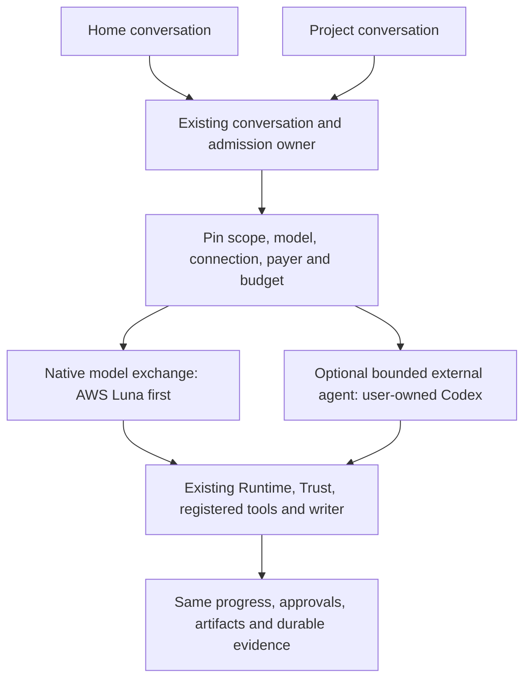

# Routing decision and owner work order

Recorded 2026-09-21 by the CD-1 integrator at Andrew's instruction. The text below the rule is
the report as Andrew supplied it, unedited. Its relative link to the prior assistance record
points into `F:/Diomedes/deliverables/bedrock-integration-20260921/`, outside this repository.

---

2026-09-21. Prepared for Andrew, bot/integration owner Claude PID 68088 and
AWS owner Claude PID 54288. Recommendations below are distinct from Andrew's
explicit directions. Existing file claims remain in force.

## Accepted directions and bounded recommendation

Andrew explicitly requires Luna through AWS Bedrock as the initial default,
using the company's eligible AWS credits. That includes the home/main bot;
AWS support limited to project conversations would miss the requested result.
Muse is the preferred fallback when an appropriate route is available. Andrew
keeps Claude on the bot and this lane on separate Bedrock/research assistance.
He wants a working bot before a broader platform build-out.

Whether every Diomedes Agent must forever be API-only, and whether subscription
fallback should be automatic, were questions rather than settled decisions.
Recommendation: make the normal Diomedes Agent an API-backed native supervisor,
while preserving optional user-owned API, local and supported external-agent
connections. This preserves the existing Personal/BYO product and does not make
a ChatGPT subscription a prerequisite. Keep automatic subscription fallback out
of the first milestone.

The first milestone uses Andrew's explicitly selected AWS connection in the
local backend. Company-funded customer delivery later places credentials and
budget admission behind an authenticated service. These are deployment stages
of the same Runtime/Trust model, not separate bot architectures.

## One conversation and two execution styles

A provider API supplies inference to Diomedes' native loop. A Codex app-server
supplies a separate agent session with its own demonstrated controls. An MCP
connection supplies tools/data. Do not substitute one of these contracts for
another or nest a second autonomous tool controller inside `ModelAdapter`.

## Route and funding policy

| Route | Intended role | Payer and boundary | Initial status |
| --- | --- | --- | --- |
| AWS Bedrock Luna | Default home and project native model | Selected AWS account; credit application separately evidenced | Active implementation, not accepted live |
| Paid OpenCode Zen Muse Spark 1.3 | Preferred later API fallback candidate | Separate Zen balance/account and data terms | Research verified; implementation/account readiness unproven |
| User's Codex subscription | Optional stronger-model or specialist bounded task | That user's native account, available models and quota | Existing constrained route; catalog repairs remain |
| Customer BYO API/local endpoint | Optional self-managed capacity | Explicit customer connection and data policy | Preserve current product; do not make new providers a first-release dependency |
| Diomedes managed API | Default funded customer experience | Server-controlled credentials, tenant entitlement and metering | Separate production milestone; current local key setup is insufficient |

Initial AWS route: Responses at
`https://bedrock-runtime.us-east-1.amazonaws.com/openai/v1`, model
`us.openai.gpt-5.6-luna`, `store:false`, bounded serial tools and no automatic
fallback. The endpoint region is not a single-region processing guarantee:
this selector uses US cross-region inference. Luna's optional Mantle route
retains its model-specific `/openai/v1` suffix and is a separate selection.
These values were checked against the [AWS Luna model card](https://docs.aws.amazon.com/bedrock/latest/userguide/model-card-openai-gpt-56-luna.html).

Use the Vercel AI SDK with an explicitly bound provider instance. The SDK does
not require Vercel hosting or Vercel AI Gateway. Do not route through a default
gateway string and assume it charges AWS. AWS runtime has no OpenAI-compatible
`GET /models`; discovery uses control-plane APIs or a reviewed explicit model
candidate. An invoke-only credential need not gain listing privileges to use
that candidate. [AWS Responses documentation](https://docs.aws.amazon.com/bedrock/latest/userguide/inference-responses-api.html)

Muse's paid Zen route lists `muse-spark-1.3` at
`https://opencode.ai/zen/v1/responses`. Keep the cheaper Go/Free Contributor
variants distinct: their training/data terms differ, and Go is designed for
coding-agent traffic. The business default must not silently substitute a
Contributor route. Muse on Bedrock, Azure or Google was not established by this
research. [Zen documentation](https://opencode.ai/docs/zen/),
[Go documentation](https://dev.opencode.ai/docs/go/)

Codex supports native ChatGPT authentication and product integration through
app-server. Select only models and reasoning settings actually returned by the
matched runtime/account; do not promise Astra to every Pro customer or convert a
subscription token into an SDK API credential. The current source pins protocol
0.153.4, so current public methods still require schema compatibility checks.
Keep its existing isolation and narrower tool capabilities until separately
proved. [App-server](https://learn.chatgpt.com/docs/app-server),
[authentication](https://learn.chatgpt.com/docs/auth)

Subscription policy is provider-specific. Claude's SDK documentation restricts
third-party products offering claude.ai login/subscription limits without prior
approval. A general subscription fallback switch cannot assume all providers
permit the same integration. [Claude Agent SDK](https://code.claude.com/docs/en/agent-sdk/overview)

## Fallback and automatic updates

For the first AWS proof, a failed or exhausted route stops with an actionable
state. For later optional fallback, configure the allowed connection, model,
payer, geography, data policy and cost limit once. An admitted checkpoint can
then use that policy without repeated routine approval. Missing authority,
uncertain prior dispatch, incompatible tools or unknown funding must not become
a silent route change. A 429 is not proof that credits ran out.

Preserve requested, resolved and provider-reported model identities. A catalog
refresh may discover new choices, but must not replace the saved model, promote
unverified tools or change billing. Key catalog evidence by connection/account,
auth generation, endpoint/geography and runtime version; reject stale refresh
results after an account switch. Native Codex discovery should precede its disk
cache, which is only stale fallback evidence. Bound bytes before parsing.

Keep model metadata, local weights, engine binaries and desktop updates as
different update operations. Hermes remains the MIT implementation reference
for later local installation; its installation workflow is not a prerequisite
for the Luna milestone. No proprietary installation code is being copied.

## Ordered work, attached to existing owners

These are owner-addressed tasks, not newly claimed production files. They amend
SDKR-CONN-02; they do not restart the unified execution package or mark prompts
DONE.

| Order / task | Owner and dependency | Concrete result required |
| --- | --- | --- |
| 1. Accept shared admission and conversation repairs | Existing bot owner; CD-01/CD-05 independent reviewers | Latest repaired candidate passes the preserved mode, command identity, target, recovery and client acceptance cases. Earlier superseded acceptance cannot close this gate. |
| 2. Compose existing AWS implementation | AWS owner plus bot owner for six shared files; SDKR-CONN-02 F01/F02/F04/F05 | Reuse local commit `3c91a51` and owner patches; adopt the repaired RunService guard and durable outcome paths. Preserve actual tool/writer authority and usage uncertainty. No parallel conversation backend. |
| 3. Home Luna default and Stop | Bot/Console owner with AWS route contract | Home answers with the selected Luna API route without a Claude login or selected work project. Consequential work uses an explicit target; never the last-used project by inference. Stop reaches the actual active driver; Work obeys the admitted route. |
| 4. Independent composed acceptance | Existing reviewers after an exact candidate is available | Re-run earlier AWS counterexamples and relevant ZIP cases against the composed commit. Then repository gates under the exclusive slot. Mock, live, billing and package evidence remain separate. |
| 5. Founder packaged AWS journey | Existing owners/reviewer once local readiness and provider setup are concrete | Synthetic source read, grounded answer, denied write, new approved artifact, stop and restart in the named Windows package. Record source/artifact hashes and actual provider usage. |
| 6. Account-aware catalog and Codex discovery | Connection/native integration owner; F03/F06 after additive identity contract | Per-account invalidation, generation fencing, native paged model/list, bounded metadata, truthful subscription limits and preserved pinned-runtime isolation. |
| 7. Muse direct API candidate | API adapter owner; amended F07 after shared mapping accepted | Separate paid Zen connection, `muse-spark-1.3`, documented Responses protocol, no OpenCode CLI requirement, no implicit Go/Contributor/AWS substitution. An AWS-only first release need not wait for this. |
| 8. Managed customer launch | Managed gateway/entitlement owner; separate release scope | Reuse existing identity/payer/allowance owners. Authenticate tenants, reserve and meter server-side, support revocation and deny cross-tenant effects. Never ship a company provider key. |

Automatic credential renewal is a separate demonstrated capability from a
manually entered expiring token. The first bounded test may use the latter with
honest expiry/renewal instructions; do not mark renewable-identity cases passed
or claim unattended continuity without implementation and evidence.

## Present evidence and merge boundary

Live remote main was checked at `d4f5384168d3071951f4c82405a4b66896a2326b`.
PR [#29](https://github.com/andrewgodowsky-aoa/diomedes/pull/29) remains open and
draft at `105adfca7f1900d669ae4572d2a0c89f46861800`. The AWS lane is at local
`3c91a51b6bee7f156ff3a59b611f02ffad7a427e`, with six shared owner files still
uncommitted. Those modifications belong to the existing owners.

The AWS owner's 4,316 unit passes / one skip and 126 browser passes are reported
candidate evidence, not a rerun of this composition. Our earlier frozen AWS
review had seven original passes and four independent failures. The bot owner
is repairing the shared boundary; those old failures must be rerun on its
successor, not asserted to be unchanged or declared fixed from a report. See
[the prior assistance record](../bedrock-integration-20260921/LIVE-LANE-ASSISTANCE-20260921.md).

No new code acceptance, paid provider run, credit application confirmation,
package acceptance, merge or deployment is claimed by this research. The single
PR plan is preserved. Andrew has authorized publication upon agreed success;
the missing condition is exact accepted integration/runtime evidence.

## Exact proposed canonical amendments

Observed mirror versions: Core Pillars 2026-09-19.1, Live Roadmap 2026-09-19.2,
Project Memory 2026-09-19.2. These additions remain pending owner reconciliation
with fresh cloud revisions and repository mirrors. They record the explicit
default and sequencing; they do not decide the still-open API-exclusive product
question.

### Pillars: append to the native Diomedes Agent contract

> The initial default native Diomedes Agent model is Luna on AWS Bedrock in both
> workspace-home and project conversations. The first owner-operated release
> may use an explicitly configured AWS account in the local backend. Company
> credits serving customer installations require server-controlled credentials
> and tenant-bound admission. Existing self-managed local/BYO and supported
> external-agent routes remain available under their demonstrated capabilities.

### Roadmap: append to the current native-agent sequence

> First accept the composed conversation/admission and direct AWS Luna route,
> including the home entry, registered tools, approved artifact writing and
> packaged interruption/recovery. Account-scoped catalog/Codex repairs and a
> distinct paid Zen Muse candidate follow. Managed local installation, broader
> automatic fallback and managed customer hosting are separate milestones.

### Project Memory: append to the model/route/payer definition

> AWS Luna is the initial home/project default; Muse is the preferred candidate
> for an explicitly configured compatible fallback. Startup credits, application
> allowance, provider cost and personal subscription quota are separate facts.
> A discovered model or successful request does not prove credit eligibility.
> Subscription-backed external agents are user-owned connections, not pooled
> company funding. The initial AWS proof performs no automatic payer fallback.
